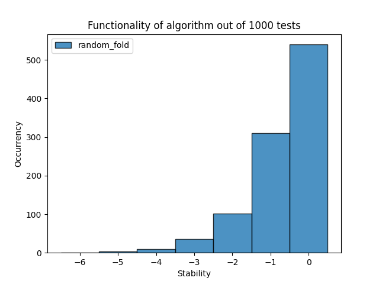

# Baseline
Met ons random algoritme hebben we geprobeerd om een eiwit in een random opgevouwen staat te krijgen. Dit werd gedaan door het proteïne een aantal keer op te vouwen op een random wijze om een bepaalde configuratie te krijgen. Deze vouwingen noemen we random, maar dat zijn ze eigenlijk niet. De manier die wij gebruiken om dat te bepalen zijn namelijk gemaakt door de mens en die kunnen dus nooit volledig random zijn en daarom moeten we het "pseudorandom" noemen. Doordat ons algoritme pseudorandom is, is de kans op elke vouw niet uniform verdeeld en hebben enkele opties op bepaalde momenten meer kans dan anderen. Toch is het verschil in deze kansen zo klein dat het uiteindelijk niet veel uitmaakt en is het algoritme zo goed als random. Daarnaast worden enkele oplossingen ook niet bekeken, bijvoorbeeld een eiwit waarbij de aminozuren helemaal niet naast elkaar zitten. Dit komt door de constraints die wij hebben opgelegd aan het algoritme.

## Resultaten
Hieronder zal ik laten zien wat voor eiwit het algoritme maakt met de volgorde "HHPHHHPHPHHHPH". Dit wordt gedaan door het algoritme 100x aan te roepen en de resultaten in een histogram te plotten. \
In deze plot is te zien dat het evenwicht van de stabiliteit bij 0 zit. Vervolgens zijn er steeds minder gevallen waarbij het algoritme een eiwit teruggeeft met een betere stabiliteit. Dit komt doordat er veel minder gevallen zijn met een goede stabiliteit dan met een slechte stabiliteit.